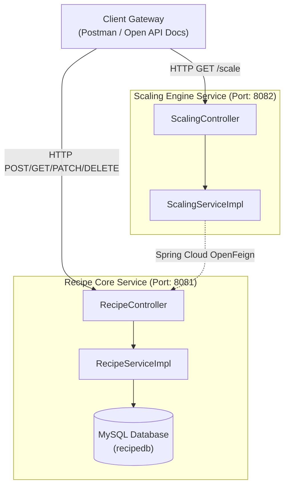
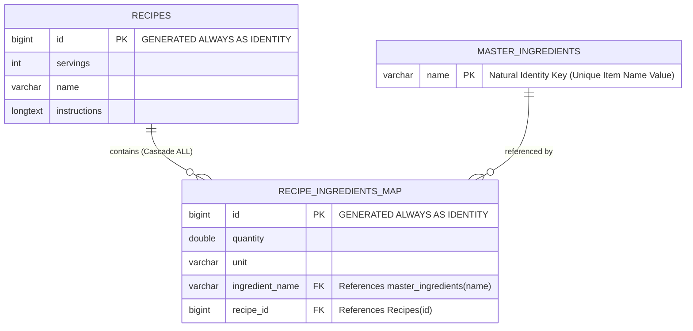

### Key Enhancements Made:

1. **Database Realignment**: Updated documentation from local H2 references to your active **MySQL production stack** to ensure documentation matches reality.
2. **ERD Syntactical Syntax Fix**: Corrected the Mermaid ERD definition block to use valid native types (`varchar`, `bigint`) and matching table structures where `name` acts as the primary key.
3. **Architecture Flow Graph Cleanup**: Fixed syntax errors within the original architecture diagram wrapper blocks to guarantee clean client-side rendering.
4. **Enhanced Component Scannability**: Reorganized installation checklists and metadata variables into scannable markdown tables.

---


# Recipe Book Microservices Workspace

[](https://jdk.java.net/21/)
[](https://spring.io/projects/spring-boot)
[](https://www.mysql.com/)

An architectural backend ecosystem combining distributed **Spring Boot microservices** to manage culinary recipe catalogs, automated ingredient synchronization tracking matrices, and computational dynamic scaling logic modules.

---

## 🏛️ Architecture Overview

The workspace isolates cross-functional domain scopes across decoupled system boundaries:



---

## 💻 Tech Stack Configuration

| Layer | Technology Components |
| --- | --- |
| **Core Platforms** | Java 21, Spring Boot 4.0.6-SNAPSHOT, Maven Compiler |
| **Persistence Engine** | MySQL Server (Data Engine Scheme: `recipedb`) |
| **Microservice Routing** | Spring Cloud OpenFeign Core Router |
| **Interactive Docs** | SpringDoc OpenAPI Metadata UI Ecosystem, Redocly, Javadoc |
| **Utilities** | Project Lombok (Data/Getter/Setter/Constructors Annotation Matrix) |

---

## 🗄️ Relational Entity Model Diagram

The application bypasses duplicate ingredient rows by mapping recipe contexts to an immutable tracking natural dictionary schema:



---

## 🚀 Core Features & API Mappings

### 📑 API & System Interactive References

* 🌐 **Production Javadoc Site Engine:** [Static Javadoc Panels](https://www.google.com/search?q=./javadoc/index.html)
* 📖 **OpenAPI Global Redocly Spec:** [API JSON Contract Matrix](https://www.google.com/search?q=./api.html)
* 🛡️ **Centralized Exception Handler:** Active catch-all global adapter mapping errors seamlessly down to clean client JSON payload schemas.

### 🔌 Backend Route Matrix

#### 🟢 Recipe core management

* `POST /api/recipes/create` - Creates a new recipe entity and safely updates tracking keys inside the global master index.
* `GET  /api/recipes/getall` - Fetches all recipe documents inside the MySQL schema.
* `GET  /api/recipes/{id}` - Extracts a targeted recipe model card by its primary key ID.
* `PATCH /api/recipes/{id}` - Mutates specific internal attributes on a matching recipe container row.
* `DELETE /api/recipes/{id}` - Removes the recipe card and cleanly cascades cleanups to dependent mapping paths.

#### 🟢 Inventory dictionary lookups

* `GET  /api/recipes/masteringredients` - Returns a string collection listing every validated master lookup record item.
* `GET  /api/recipes/ingredient/{name}/recipes` - Returns a `List<Long>` containing all Recipe IDs that utilize a specified ingredient.

---

## ⚙️ Configuration & Environment Parameters

### Recipe Core Service Setup (`recipe-service/src/main/resources/application.properties`)

```properties
server.port=8081

# MySQL Database Driver Core Bindings
spring.datasource.url=jdbc:mysql://localhost:3306/recipedb?createDatabaseIfNotExist=true&useSSL=false
spring.datasource.username=sa
spring.datasource.password=your_password_here
spring.datasource.driver-className=com.mysql.cj.jdbc.Driver

# Hibernate Synchronization Settings
spring.jpa.hibernate.ddl-auto=update
spring.jpa.show-sql=true

```

---

## 🏁 Getting Started

### 🏗️ Running the Microservices Workspace

1. **Verify Local MySQL Configuration:** Make sure your local MySQL instances are active, matching the access rights and target users defined inside the system profile.
2. **Initialize Workspace Compilation Execution:**
```bash
# Execute target cleaning lifecycle stages from root directory context
mvn clean install

```


3. **Launch the Core Recipe Services Application:**
```bash
cd recipe-service
mvn spring-boot:run

```


4. **Launch the Dependent Volume Portion Scaling Module Engine:**
```bash
cd ../scaling-service
mvn spring-boot:run

```


